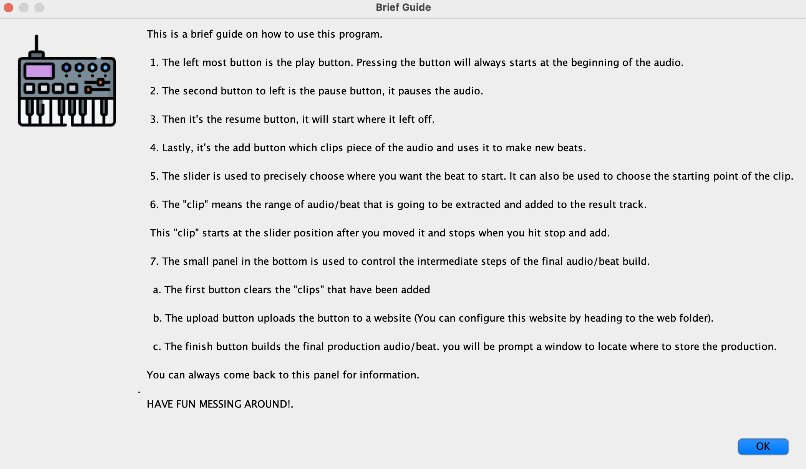
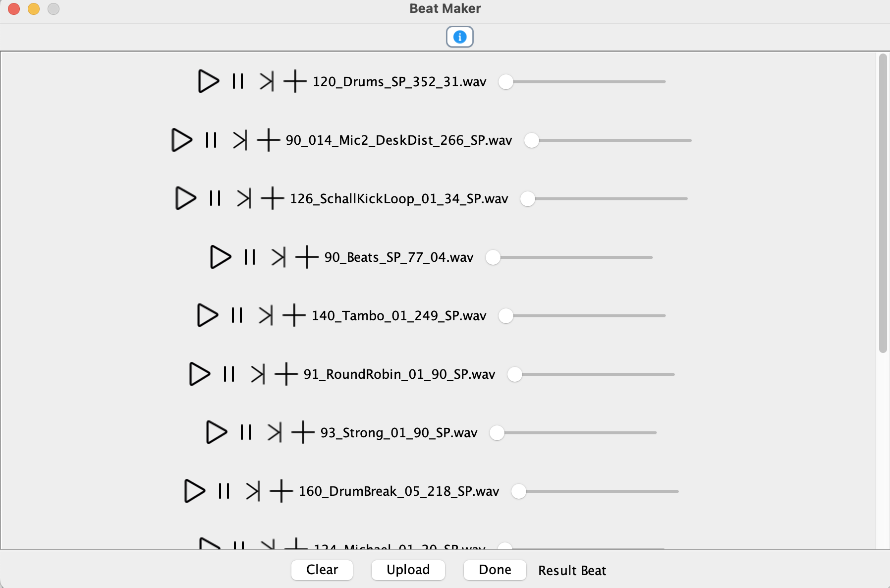

# MyGrooveFusion
Hey, try out this awesome beat maker! 

Groove Fusion provides a java GUI for you to interact with a list of different cool beats. 
You can mix you own beat with the variety beats provided to you!

## Important
The audios used in the program are only for personal use. It is not for commercial purposes. The audios are from [noiiz.com](www.noiiz.com).
I do not own the rights to these audios. All the copyrights belong to the owner of those audios. More details about the creator of these audio
can be found at [noiiz.com](www.noiiz.com).

### Why I created this project
I listen and enjoy music every single day, mostly Hip Hop and R&B. I watched a video about one of the producer that I liked, so I wanted
to explore a little bit more about the music side of programming. This project is a way for me to explore different fields that I'm interested in
(in this case, programming and music).

## Some Snapshots of the program

